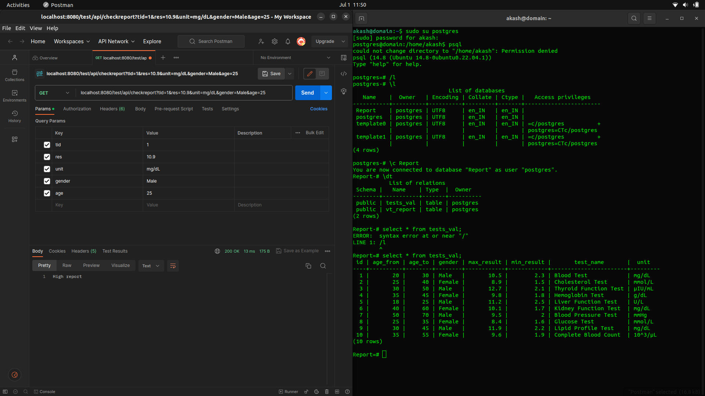

# eHospital Lab Report Validating API
The Lab Report Validating API is a web service that allows you to validate data from lab report by checking it in existing patient's database and to show error messages as response output.If patients data is showing high,low or normal result,the API will also reflect respective response. 

## Create Database
To create Postgres database in CLI, follow these steps:

1.Start Postgresql Service:

   `psql `

2.Create Database:

   `CREATE DATABASE Report `

## Build and Run
To build and run the Lab Report Validating API, follow these steps:

1. Clone the repository from GitHub:
   
   `https://github.com/Akash-nitA/NIC.git `
   
2. Navigate to the project directory:
   
   `cd NIC`
   
3. Build the project using Maven:
   
   `mvn clean package`
   
4. Run the application:
   
   `java -jar target/NIC-0.0.1-SNAPSHOT.jar`
   
## INSERT DATA INTO TABLE
To create Postgres database in CLI, follow these steps:

1.Insert Data:

   `INSERT INTO tests_val (id, age_from, age_to, gender, max_result, min_result, test_name, unit)
    VALUES
    (1, 18, 30, 'Male', 95.5, 70.2, 'Test 1', 'mg/dL'),
    (2, 25, 40, 'Female', 110.3, 80.1, 'Test 2', 'mmol/L'),
    (3, 40, 60, 'Male', 120.8, 90.5, 'Test 3', 'mg/dL');
 `

2.Follow above step to insert more data by changing respective values.

The API will be accessible at `http://localhost:8080`.

## Description
### Validating Report Data
**Endpoint:** `/api/checkReport`

**Method:** GET

**Description:** Checks Report Data and validate it using existing database and return respective Response message.

**Request Parameters:**

| Parameter   |      Type      |           Description          |
|-------------|:--------------:|-------------------------------:|
|  tid        |     integer    |      Particular test id number |
|  res        |     float      |      Particular Test Result    |
|  unit       |     string     |      Particular Test Unit      |
|  gender     |     string     |      Particular Test Gender    |
|  age        |     integer    |      Particular Test Age       |

**Success Response:**

1. Result Exceeding Upper Limit
- *Status Code:* 200 OK
- *Body:* `High Report`

2. Result Below Lower Limit
- *Status Code:* 200 OK
- *Body:* `Low Report`

3. Result In Range
- *Status Code:* 200 OK
- *Body:* `Valid Report`

4. Patient Age Not In Range
- *Status Code:* 200 OK
- *Body:* `Invalid`

5. Particular Test_ID Doesnot Exist
- *Status Code:* 200 OK
- *Body:* `test case not found in database`

## Libraries and Tools Used

The following libraries and tools are used in this API:
- Language :  Java (JDK 20) 
- Framework:  SpringBoot (3.1.2 Snapshot) 

## Dependencies
Maven Dependencies used:
- spring-boot-starter-data-jpa
- spring-boot-starter-jdbc
- Postgresql Driver
- spring-boot-starter-web

## License
This API is open source and licensed under the MIT License.

## Contributions
Contributions to this project are welcome. If you encounter any issues or have suggestions for improvements, please open an issue or submit a pull request on the project's repository or mail me at akashacharjee212@gmail.com
